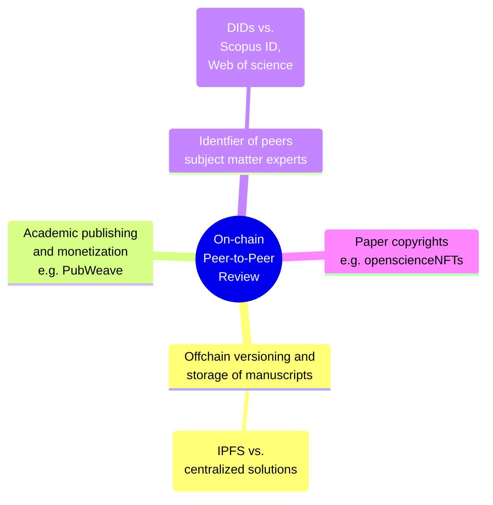
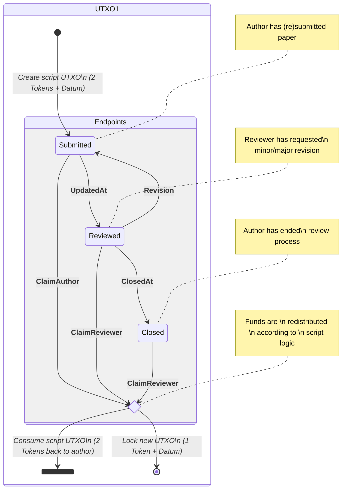

# CDP Project
## Introduction
A "peer-to-peer review" is a proof of concept exercise that shows how a decentralized, blockchain-based system could be used to establish the quality and credibility of academic papers. By allowing a large number of reviewers (i.e. identified peers) to participate in a transparent way, the system aims at incentivizing a thorough and honest behaviour without the need of centralized authorities or intermediaries (e.g journals, peer-review platforms, conference organizers). For more information on promoting transparency, inclusivity, and accountability in the peer review process, you can learn more about [open peer review](https://www.fosteropenscience.eu/learning/open-peer-review/#/id/5a17e150c2af651d1e3b1bce).


#### Assumptions
The goal of this project is to show a viable mechanism for a reviewing process (the grey circle in the diagram), assuming that other elements of a decentralized, permisionless and censorship-resistant academic ecosystem are in place. All of these can be broadly summarized in the following diagram, although their implementation goes beyond the scope of this project:



#### Objectives 
- <b>Transparency</b> is guaranteed by the Cardano blockchain history, where information like reviewer's final decision, a link to the documents in a  decentralized version control system (e.g. ipfs textile bucket), number of paper revisions and the reviewer's public key hash (or a name handle for a more transparent solution) is stored and retrievable (e.g. by [Blockfrost query](https://docs.blockfrost.io/#tag/Cardano-Scripts/paths/%7E1scripts%7E1datum%7E1%7Bdatum_hash%7D/get)); 

- <b>Inclusivity</b> is fostered by allowing any peer, i.e., accredited subject matter expert, to voluntarily participate in the reviewing process, rather than being limited to a pre-selected number based on internal decisions made by the editors; 

- <b>Accountability</b> is achieved by requiring reviewers to place a predefined stake that they may lose if they fail to meet their reviewing responsibilities and deadlines.

## Reviewing Process
The following diagrams are a simplification of the on-chain steps behind the reviewing process. Go [here](https://github.com/gufett0/mesposito_CDP/tree/main/src) for a detailed description of the source code and testing scenarios. 


#### Validator Txs flowchart 
The below state diagram shows the various steps of the reviewing process (endpoints grey area) where <i>Datums</i> and <i>Redeemers</i> are depicted in the state boxes and tranistion lines respectively. Once the reviewing process is over, either 2 or 1 NFT must be returned to the author. The latter case would mean that the other NFT will be locked in the script along with the datum containing the final review info (i.e. whether the paper got eventually rejected or accepted by the reviewer).


So, after a single review gets closed, its locked utxo will have a datum similar to this:

```
PaperDatum{
d_linkToManuscript    = Manuscript "/ipns/QmS4ust...4uVv",
d_reviewerPkh         = "557d23c0a533b4d295ac2dc14b783a7efc293bc23ede88a6fefd203d",  
d_currentDecision     = Just Minor,
d_nextDeadline        = Nothing,
d_status              = Closed (Round 2),
d_allRevDecisions     = Nothing,
d_peerReviewed        = False
}

```


#### Concurrent Approach
According to [IOG](https://iohk.io/en/blog/posts/2021/09/10/concurrency-and-all-that-cardano-smart-contracts-and-the-eutxo-model/), enabling concurrency is crucial for facilitating multiple actors to work simultaneously on a given task without causing interference with each other. Therefore, conducting the reviewing process in parallel within the same smart contract can be a more efficient approach.

To enable parallel execution of the reviewing process within the same smart contract, it is necessary to track the UTXO where validation for a specific transactions occurs. This can be achieved by storing a pair of NFTs, whose name and policy are included in the script parameter, for each UTXO created at the script address and including a field with the payment public key hash of the reviewer in the datum of every UTXO. This ensures that the validation activity of both reviewers and authors is accurately recorded and tracked (check the TestsParallel.hs code). 

The below state diagram shows the Reviewing process occurring in parallel at different Utxos. 

```mermaid
stateDiagram-v2
    state Script_Address {
        state Final <<choice>>
        state Final2 <<choice>>
        state Final3 <<choice>>
        state Empty <<fork>>
        state Empty2 <<fork>>
        state Empty3 <<fork>>
        state UTXO1 {
        [*] --> Reviewing_1
        Reviewing_1 --> Reviewing_1: Validator
        Reviewing_1 --> Final
        Final --> Empty : Invalid
        Final --> <b>Locked1</b> : Valid
        <b>Locked1</b> --> [*] : Final decision  <i>Accept</i> 
        }
        --
        state UTXO2 {
        [*] --> Reviewing_2
        Reviewing_2 --> Reviewing_2: Validator
        Reviewing_2 --> Final2
        Final2 --> Empty2 : Invalid
        Final2 --> <b>Locked2</b> : Valid
        <b>Locked2</b> --> [*] : Final decision  <i>Reject</i> 
        }
        --
        ...
        --
        state UTXOn {
        [*] --> Reviewing_n
        Reviewing_n --> Reviewing_n: Validator
        Reviewing_n --> Final3
        Final3 --> Empty3 : Invalid
        Final3 --> <b>Locked_n</b> : Valid
        <b>Locked_n</b> --> [*] : Final decision <i>Accept</i> 
        }
    }
```




Once a minimum number of peers has reviewed the paper and most of final decisions are positive (e.g "Accept"), each relevant UTXO may be consumed at the script address by the author to create a new single UTXO with a final "peer-reviewed" datum:

```
PaperDatum{
d_linkToManuscript    = Manuscript "/ipns/QmS4ust...4uVv",
d_reviewerPkh         = Nothing,  
d_currentDecision     = Nothing,
d_nextDeadline        = Nothing,
d_status              = Closed (Round 0),
d_allRevDecisions     = Just [(557d...203d,Accept),(2e0a...a27c,Reject),(80a4...3ca7,Accept)]
d_peerReviewed        = True
}

```


## Cardano Professional Developer 
Find Certificate at this link
