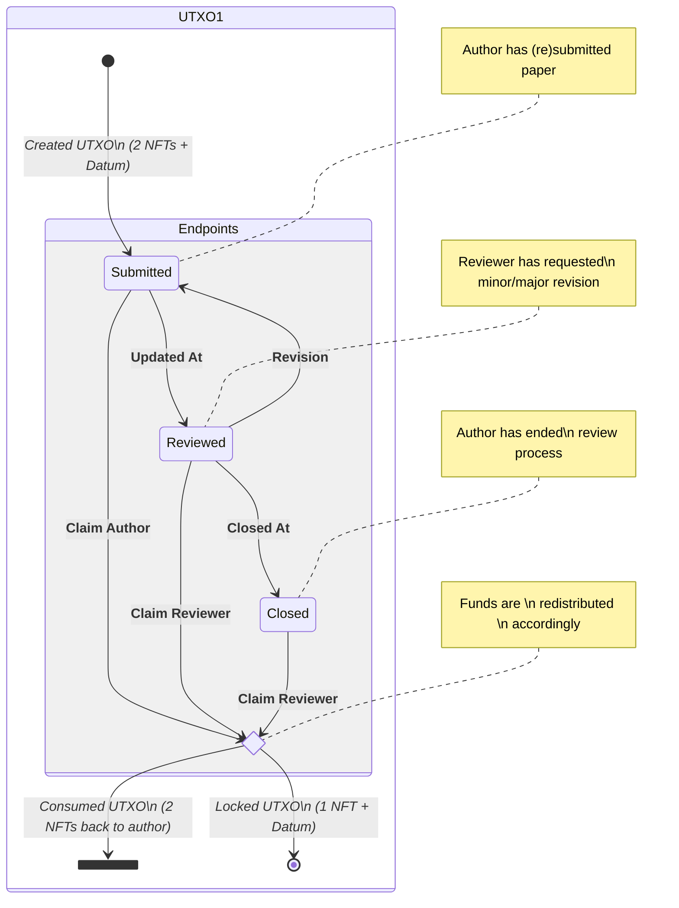

# mesposito_CDP

## Introduction
`peer-to-peer review` is a proof of concept exercise that shows how a decentralized, blockchain-based system could be used to establish the quality and credibility of academic papers. By allowing a large number of reviewers (i.e. identified peers) to participate in a transparent way, the system aims at incentivizing a thorough and honest feedback without the need of centralized authorities or intermediaries (e.g journals, peer-review platforms, conference organizers). For more information on promoting transparency, inclusivity, and accountability in the peer review process, you can learn more about open peer review.

#### Review process

#### Concurrent implementation

```mermaid
stateDiagram-v2
    state Script_Address {
        state Final <<choice>>
        state Final2 <<choice>>
        state Final3 <<choice>>
        state Empty <<fork>>
        state Empty2 <<fork>>
        state Empty3 <<fork>>
        state ID_01 {
        [*] --> Reviewing_1
        Reviewing_1 --> Reviewing_1: Validator
        Reviewing_1 --> Final
        Final --> Empty : Invalid
        Final --> <b>UTXO1</b> : Valid
        <b>UTXO1</b> --> [*] : Final Datum
        }
        --
        state ID_02 {
        [*] --> Reviewing_2
        Reviewing_2 --> Reviewing_2
        Reviewing_2 --> Final2
        Final2 --> Empty2 
        Final2 --> <b>UTXO2</b> 
        <b>UTXO2</b> --> [*] 
        }
        --
        ...
        --
        state ID_n {
        [*] --> Reviewing_n
        Reviewing_n --> Reviewing_n
        Reviewing_n --> Final3
        Final3 --> Empty3 
        Final3 --> <b>UTXOn</b> 
        <b>UTXOn</b> --> [*] 
        }
    }
```

## Cardano Professional Developer 
Find Certificate at this link
