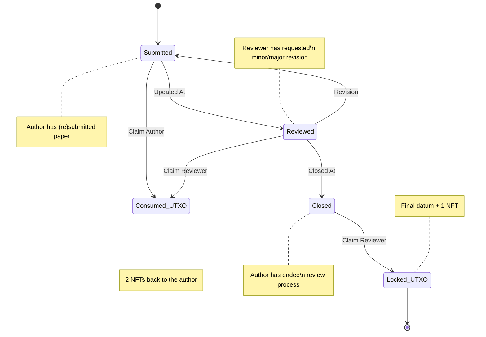

# mesposito_CDP
 My final project for the Cardano Professional Developer certificate

```mermaid
stateDiagram-v2
[*] --> Submitted
Submitted --> Consumed_UTXO : Claim Author
Submitted --> Reviewed : Updated At
Reviewed --> Closed : Closed At
Closed --> Locked_UTXO : Claim Reviewer
Locked_UTXO --> [*]
note right of Submitted : Author has (re)submitted paper
note left of Reviewed : Reviewer has requested\n minor/major revision
note left of Locked_UTXO : Final datum + 1 NFT
note right of Consumed_UTXO : 2 NFTs back to the author
note right of Closed : Author has ended\n review process
Reviewed --> Consumed_UTXO : Claim Reviewer
Reviewed --> Submitted : Revision   
```
