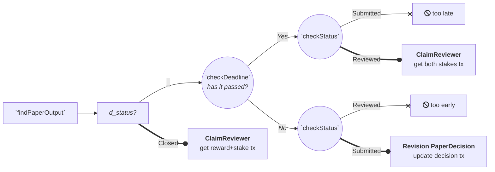
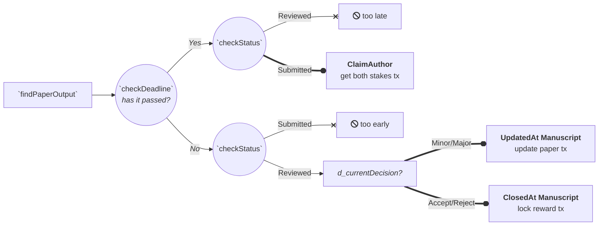

# source code description

The following is a brief walk-through of the main functions and data types of the code. 

## On-chain

The on-chain part is comprised of both a validator (ReviewContract.hs) and a policy minting (ReviewPolicy.hs) script. The former will validate spending transactions occurring during the reviewing process and the latter will validate the minting of a single NFT to the author during the closing transaction.

In the Types.hs module, we define the datum as a custom data type `PaperDatum`, containing key state information, and the redeemer `PaperRedeemer` to call for validation of specific blockchain actions. Among other useful data types, such as `Manuscript` that would take the bytestring of the paper storage link, `PaperDecision` defines the four possible options (`Accept|Minor|Major|Reject`) the reviewer can choose to update their verdict on every last paper submission.  

We also define the data type `Paper` whose fields account for the script parameters: the author public key hash, the amount of Ada at stake, the compensation for each reviewer, the least number of reviews required, the time inverval before the next deadline, and the asset class of the tracking tokens. Given the need to create a new UTXO every time the state of the paper review changes, the tracking tokens will govern the whole process in two ways:
- Identify the UTXO carrying the ongoing (`Submitted` or `Reviewed` PaperStatus type) review datum (token value: 2)
- Identify the UTXO carrying the closed (`Closed` PaperStatus type) review datum (token value: 1)
- Identify the UTXO carrying the peer-reviewed (`d_peerReviewed`=True) final datum (token value: >2)

<i>E.g: with 3 participating reviewers, the author will have pre-minted 6 tokens and locked 3 pairs in 3 different utxos. once all reviews get closed, new corresponding utxos will have 1 token each, as the other token will go back to the author. finally, the author will be able to consume them into a final script utxo bundled with the original, no-longer spendable, 6 tokens</i> 

The function `mkPaperValidator` represents the core on-chain validator and it first checks through `validate_inputs` whether there is one input with the token pair (see `oneScriptInputTwoTokens`) or more inputs containing just one token, except for those inputs coming from the author address (see `allScriptInputsOneToken`). So, only if either of these return True, inlinable functions `mkReviewing` and `mkPeerReviewed` will be called to check for several needed conditions (the ReviewContract.hs module has commented datum and redeemer cases in lines 132-247).

In particular, `mkPeerReviewed` (lines 70-125) will enforce the final datum to have fields `d_peerReviewed` equal to true and `d_allRevDecisions` equal to a list of tuples containing each reviewer's pubkey hash and corresponding final decision (see utils function `getRevPkhAndDecision`). The inner function `checkNFTname` will ensure that the pending tx also mint an Nft with its name derived from the bytestring link to the manuscript file. 

Finally, in the ReviewPolicy.hs module, we define the parametrized minting policy (`nftMintingPolicy`) for a unique NFT that can minted only if at least one script input is being validated in the same tx (see `scriptInput`). 

## Off-chain

The off-chain code is mainly comprised of the TxConstruction.hs module. Here we first define four endpoints, one for each required blockchain action:
- <b>paperSubmission</b> (61-88): 

The author submits a tx with initial `PaperDatum` and value locked to the script utxo (the stake + pair of tracking tokens). the first deadline is also defined in the datum field d_nextDeadline by adding currentTime to the timeInterval predefined in the script parameter `Paper`.

- <b>reviewerAction</b> (104-195): 

`findPaperOutput` takes in the sript parameter, the script address and the reviewer's pubkey hash to identify the utxo carrying the right datum in the contract monad, meaning the one with a pair of predefined tokens and an equal pubkey hash in the d_reviewerPkh datum field. After that, `checkDeadline` and `checkStatus` helper functions will select the following action by means of (Either String ()) as a return type, much like a decision tree:

Since the deadline gets extended by a fixed interval at each change of state, the `checkStatus` function becomes crucial to determine whether the reviewer should build a tx or not. With the right redeemer (`ClaimReviewer` or `Revision PaperDecision`) the reviewer can proceed either to make a tx that updates the datum and recreates the right utxo, or to make a tx that claim all stakes, i.e penalizing the author. In case d_status datum field was set to Closed, the pre-agreed compensation plus initial stake can be claimed back. 

- <b>authorAction</b> (211-303): 

The same logic is utilized to build transactions for the author, though with different redeemers `ClaimAuthor`, `UpdatedAt Manuscript` and `ClosedAt Manuscript`. These will respectively allow to reclaim all stakes (i.e penalizing the reviewer), recreate utxo with datum containing the updated manuscript link or close and claim only part of the stake to lock the rest as a reward for the reviewer: 

- <b>closeAction</b> (318-380): 

Here a new set of parameters includes the final NFT name that will be minted if the paper turns to be peer-reviewed. Also, a new set of helper functions (96-159 in Utils.hs) will determine if script utxos can be consumed into a single utxo with `d_peerReviewed` = True and a new `Manuscript` with a link to a final paper version.
`findLockedPaperOutputs` returns a map of all utxos with 1 tracking token and `d_status` = Closed. Similarly, `findAuthorUtxo` outputs all utxos with one or more of the previously returned tracking tokens. `checkOutputsNumber` counts if the number of utxos at script address is equal or greater than what initially agreed on in the script parameter `Paper`. Finally, `checkPaperDecisions` checks if number of final decisions Accept is greater than Reject. 

## Testing
